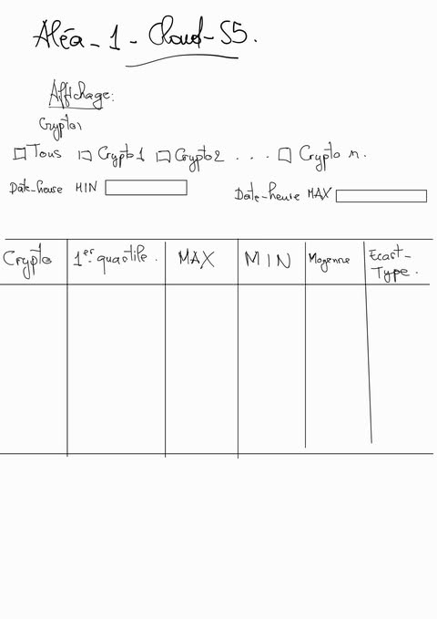
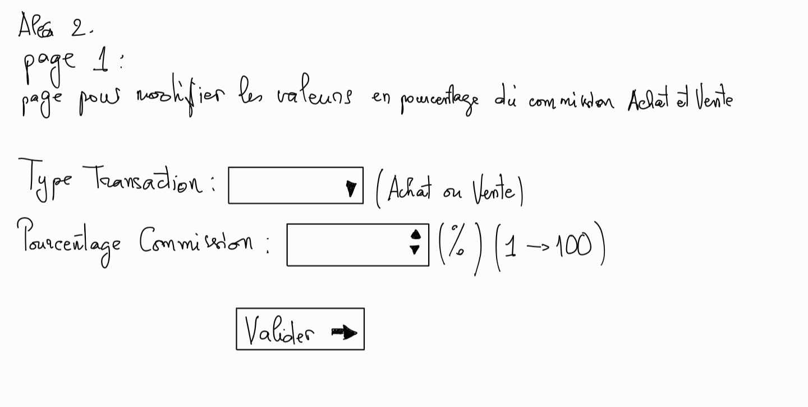
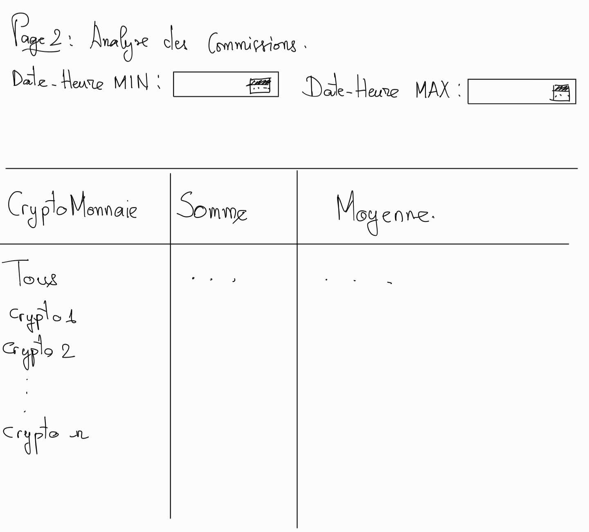
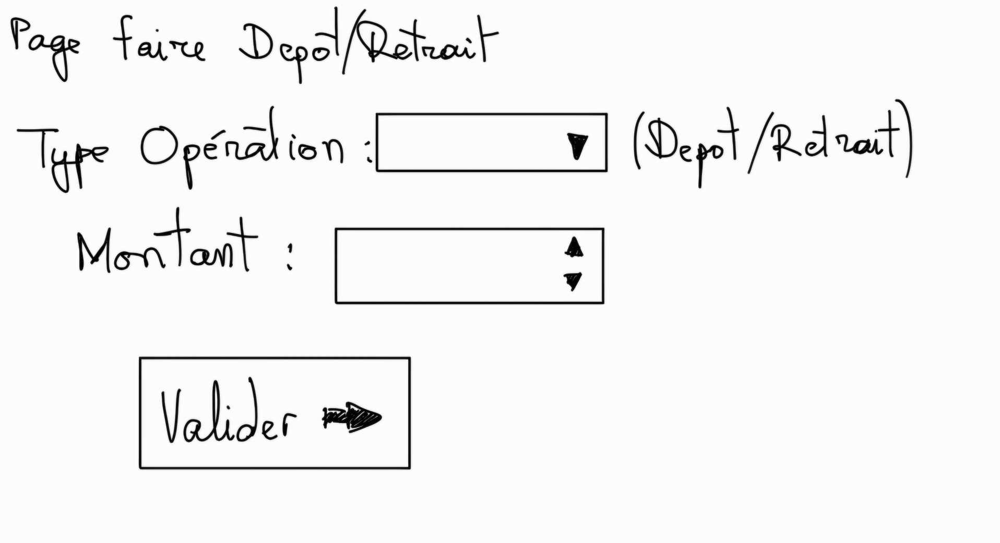
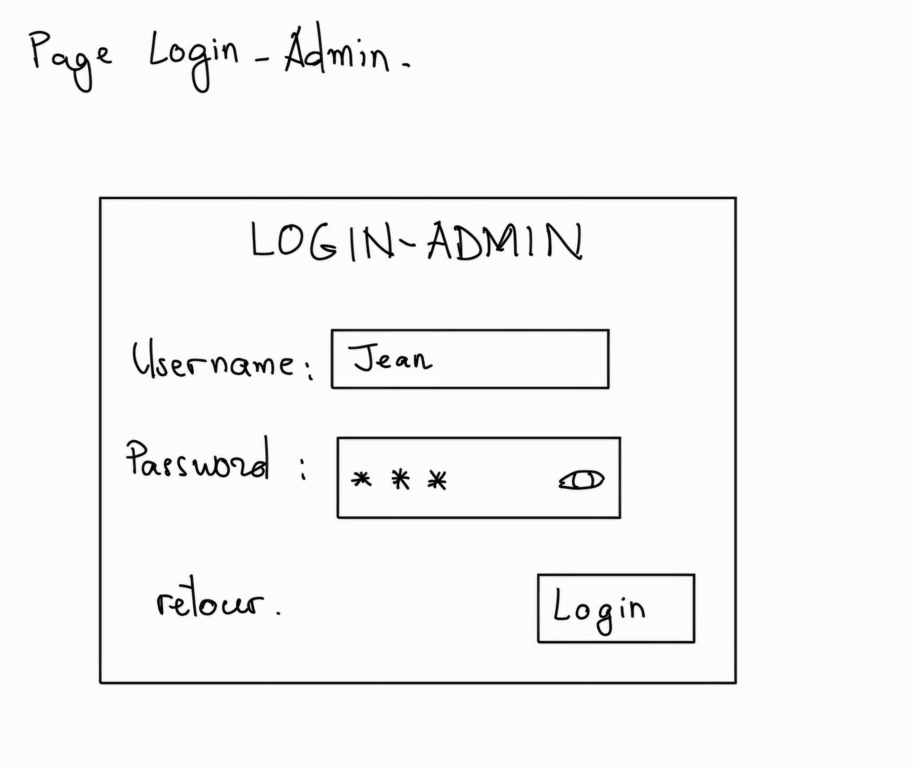
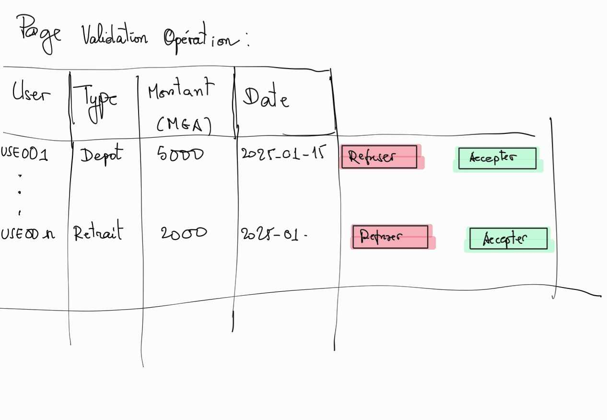

# DOCKER LOCAL 
- [] Fournisseur d'identité
    - [X] debug projet

- [] Appli web
    - [] alea V3
        - [X] test alea 3
        - [X] alea 1
            - [X] ** fonction1 : List<MvtCrypto> get mvt crypto by period and by id_crypto (id_crypto, String date_heure_min, String date_heure_max )(Stringbuilder recherche multi-critère) 

            - [X] classe AnalyseCrypto : Crypto, List<MvtCrypto> , DateHeureMin, DateHeureMax, quartile, max, min, moyenne, ecart-type

            - [X] setters des attibut avec logique

            - [X] fonction2 : AnalyseCrypto getAnalyseCrypto (List<MvtCrypto>) : creer objet AnalyseCrypto, appeler les setters

            - [X] page : Analyse crypto

            

            - [X] controller : get liste id, boucler, appeler fonction1, retourner List<AnalyseCrypto> => page

        - [X] alea 2 : partie 1
            - [X] Base : table mvtCommission : id, type_transaction,  pourcentage_commission(%), date_heure

            - [X] ** Base : alter table transaction_crypto : +  pourcentage_commission, + valeur_commission

            - [X] ** Classe : alter classe TransactionCrypto : + pourcentage_commission, + valeur_commission
                - [X] setters valeur_commission avec logique

            - [X] Classe : MvtCommission : id, type_transaction,  pourcentage_commission(%), date_heure

            - [X] fonction : MvtCommission Mvt getLastMvtCommissionByTypeTransaction  (type_transaction)

            - [X] Controller : Alter Achat Controller 
                - getLastMvtCommissionByTypeTransaction
                - [X] fonction: validerAchat() : + set pourcentage_commission, + set valeur_commission

            - [X] Controller : Alter Vente Controller 
                - [X] fonction: VendreCrypto() :
                    - [X] + set pourcentage_commission, + set valeur_commission
                    - [X] newSoldeUser = newSoldeUser - commission_value 

            - [X] fonction : insertMvtCommission

            - [X] page : 

            

            - [X] Contoller : CommissionController avec logique

        - [X] ** alea 2 : partie 2
            - [X] fonction1 : List<transactionCrypto> get transactionCrypto by period and by id_crypto (id_crypto, String date_heure_min, String date_heure_max )(Stringbuilder recherche multi-critère) 

            - [X] fonction2 : List<transactionCrypto> get all transactionCrypto by period (String date_heure_min, String date_heure_max )(Stringbuilder recherche multi-critère) 

            - [X] classe AnalyseCommission : Crypto, List<transactionCrypto> , DateHeureMin, DateHeureMax, somme, moyenne (raha tous dia Crypto null)

            - [X] setters des attibut avec logique

            - [X] fonction3 : AnalyseCommission getAnalyseCommission (List<MvtCommission>) : creer objet AnalyseCommission, appeler les setters

            - [X] page : Analyse commission

            

            - [X] controller : get liste id, boucler, appeler fonction1, retourner List<AnalyseCommission> => page 

            

        - [] Operation : 
            - [] Table Operation : id_user, type_operation, date_heure_operation, montant , date_action , status (boolean : true=validé, false=refusé, null=en attente)

            - [] Classe Operation : User, type_operation, date_heure_operation, montant , date_action , status (boolean : true=validé, false=refusé, null=en attente)

            - [] fonction1 : boolean checkSoldeBeforeRetrait(user,montant_retire)

            - [] page : Effectuer operation

            

            - [] controller OperationController avec logique

    - [] BACKOFFICE
        - [] login admin
            - [] Base : table admin : id, username, mdp

            - [] Classe Admin : id username, mdp

            - [] Fonction : Admin checkLogin(username,mdp)

            - [] Page : 

            

            - [] Controller : AdminController avec logique

        - [] Validation operation
            - [] fonction : get liste operation non validé (null date action && status null)

            - [] fonction : updateOperation(Operation) (tonga dia updater-na)

            - [] Page : 

            

        - [] Notification mobile 

    - [] FRONTOFFICE
        - [] Image utilisateur 
            - [] table Utilisateur_image : id, id_utilisateur, image

            - [] fonction : byte[] getImageByIdUtilisateur(id_utilisateur)

        - [] Historique des opérations
            - [] fonction List<Transaction> filtrer_transaction (date, heure)

            - [] Page :

            

            - [] Controller: HistoriqueTransactionController avec logique 

            

    - [] optimisation de code

# FIREBASE
- [] Notification

- [] api rest pour mobile

# MOBILE 
- [] apk telephone

    - [] pages

